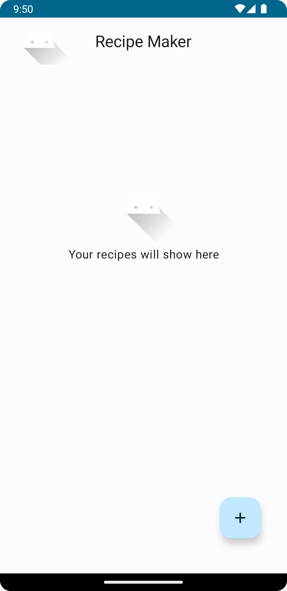
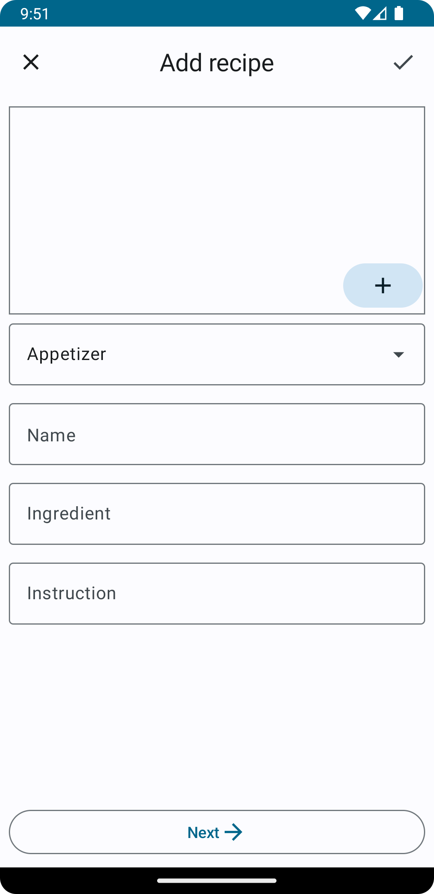
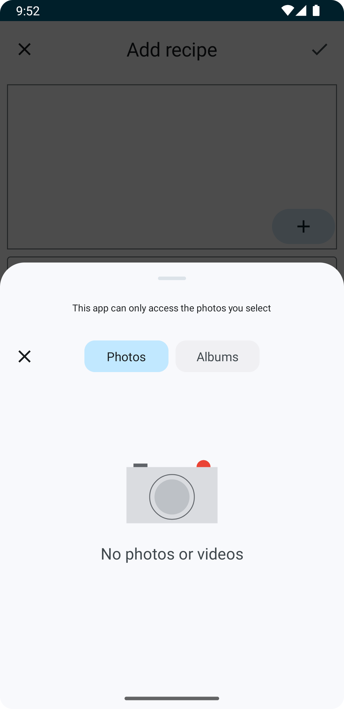
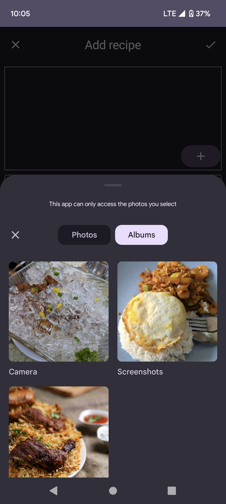
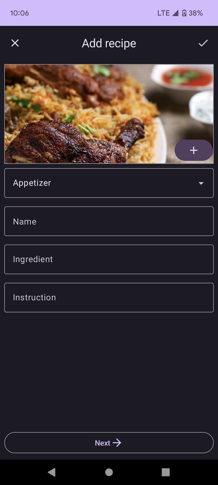
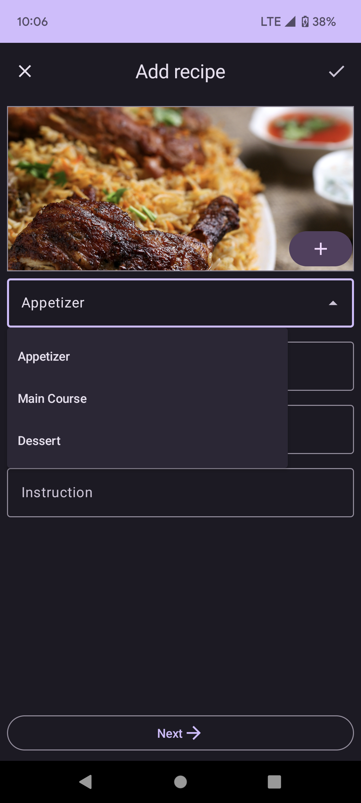
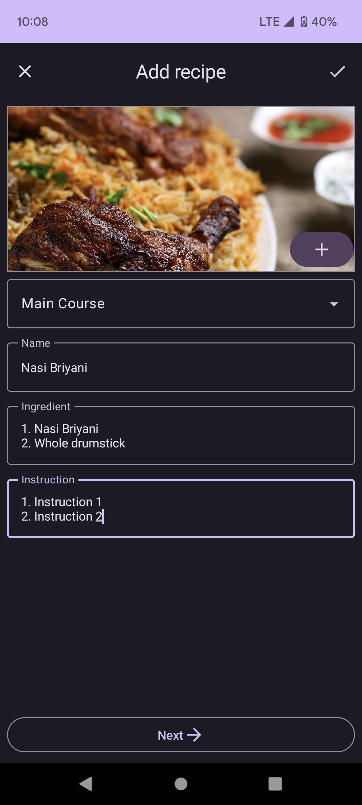
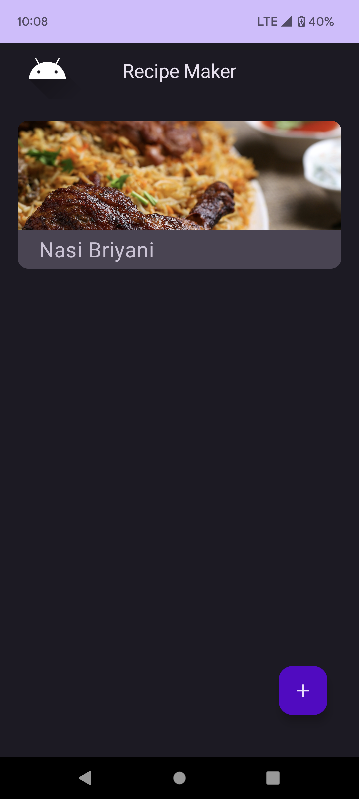
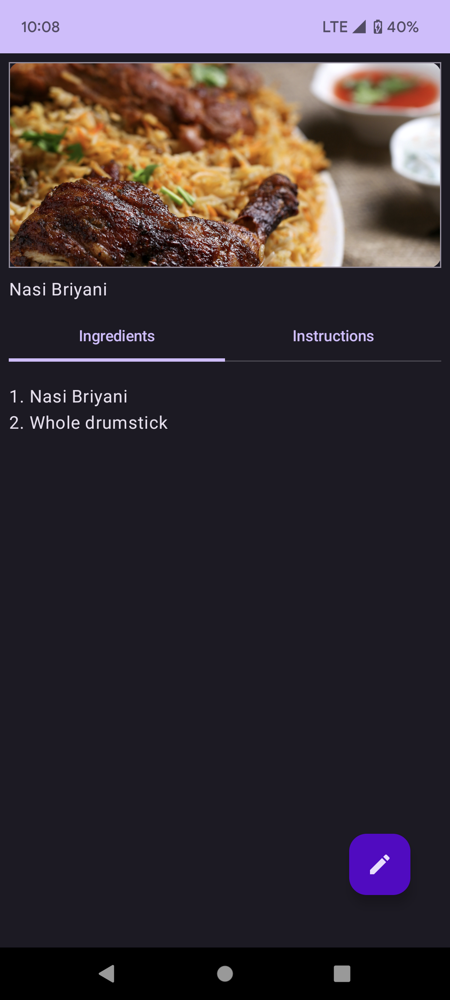

# Recipe-Maker-MVVM-Compose (WIP)
A personal project to create a simple recipe maker Android application written in Kotlin with CRUD functions that can persists recipes to local storage and database with best practices such as MVVM, Jetpack Compose and Dependancy Injection.

# Libraries
1. <a href="https://github.com/objectbox/objectbox-java"><strong>ObjectBox</strong></a> : To persist data in an NoSQL database.
2. <a href="https://github.com/coil-kt/coil"><strong>Coil</strong></a> : To load image data from local storage.

# Screenshots

  
  &nbsp; &nbsp; &nbsp;
  
  &nbsp; &nbsp; &nbsp;
  

 

  
  &nbsp; &nbsp; &nbsp;
  
  &nbsp; &nbsp; &nbsp;
  
  &nbsp; &nbsp; &nbsp;
  
  &nbsp; &nbsp; &nbsp;
  

 

  

